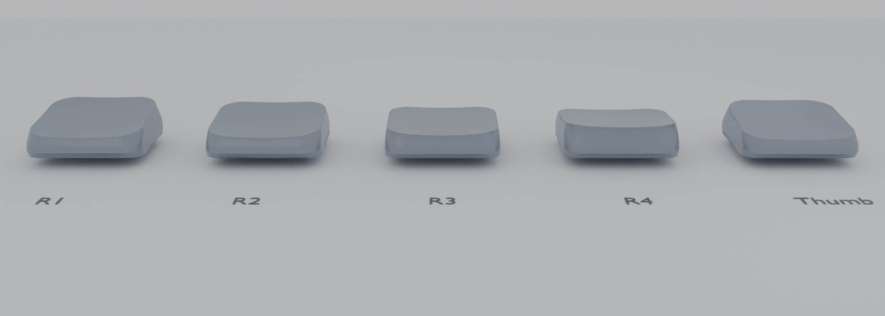
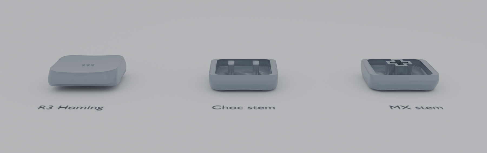

# Tiltycaps

`tiltycaps` builds a procedural low-profile keycap with a smooth saddle top while keeping the shell editable.

Current scope:

- Smooth low-profile shell proportions and saddle sculpt
- SA-inspired row variants for `R1` through `R4`, plus a flatter `Thumb` profile on the same low-profile shell
- A `low_profile` toggle, defaulting to the compact low-profile shell
- MX or Choc outer spacing, independent of the chosen stem
- Choc and MX stem options that both hang from the cap interior
- Optional homing bumps and rings that follow the saddle and row tilt
- A print-pose helper for tilted FDM export

## Files

- `tiltycaps.scad` - single-file parameter entrypoint and generator source
- `examples/*.scad` - representative example entrypoints
- `scripts/generate_stls.py` - batch STL export into a consistent `stls/` directory tree
- `scripts/render_readme_mx_spacing_overview.py` - temporary `out/` STL export plus Blender renders for the README lineup and R3 detail images
- `scripts/validate.py` - STL export and mesh sanity checks



`R1` through `R4` plus `Thumb` in the MX-spacing shell, angled to show the row profiles more clearly. Regenerate it with `python3 scripts/render_readme_mx_spacing_overview.py`, which writes temporary typing-mode STLs under `out/readme-mx-spacing-overview/` and then renders the tracked `docs/readme-mx-spacing-overview.png` and `docs/readme-mx-spacing-r3-detail.png` assets with Blender.



Detail view: `R3` with `3 dots` homing, plus flipped Choc and MX stem undersides for the same MX-spacing shell.

## Quick Start

Preview the default print pose:

```bash
openscad tiltycaps.scad
```

Preview the typing view:

```bash
openscad -D 'render_mode="typing"' tiltycaps.scad
```

Export the default `R3` MX-spaced cap with the native Choc stem:

```bash
openscad -o out/r3-choc.stl tiltycaps.scad
```

Export an `R1` variant with an MX stem:

```bash
openscad -o out/r1-mx.stl \
  -D 'row="R1"' \
  -D 'stem_family="mx"' \
  tiltycaps.scad
```

Export the compact Choc-spaced shell instead of the default MX spacing:

```bash
openscad -o out/r3-choc-spaced.stl \
  -D 'outer_family="choc"' \
  tiltycaps.scad
```

Export the taller shell instead of the default low-profile cap:

```bash
openscad -o out/r3-tall-choc.stl \
  -D 'low_profile=false' \
  tiltycaps.scad
```

Export an `R3` cap with a three-dot homing marker:

```bash
openscad -o out/r3-homing-3-dots.stl \
  -D 'homing_type="3 dots"' \
  tiltycaps.scad
```

Generate the full print-mode STL set under `stls/`:

```bash
python3 scripts/generate_stls.py
```

Preview the print pose explicitly:

```bash
openscad -D 'render_mode="print"' tiltycaps.scad
```

## Main Parameters

- `row` - `R1`, `R2`, `R3`, `R4`, or `Thumb`
- `outer_family` - `mx` by default for the larger MX-spaced footprint, or `choc` for the compact Choc-spaced footprint
- `stem_family` - `choc_v1` for the native Choc mount, or `mx` for the MX mount
- `low_profile` - `true` by default for the compact low-profile shell, or `false` for the taller shell
- `overall_tilt_deg` - additive shell tilt applied on top of the row preset
- `homing_type` - `None`, `Dot`, `2 dots`, `3 dots`, `Circle`, or `Line`
- `homing_offset_y_mm` - front/back offset of the homing feature on the saddle, with `0` at the key center
- `homing_scale` - overall size multiplier for the homing feature
- `render_mode` - `print` by default, or `typing`
- `print_angle_deg` - print-pose rotation angle, defaulting to the current print-lip facet
- `clearance_mm` - MX stem clearance tolerance, used only for `stem_family="mx"`

## Examples

- `examples/r3-standard.scad` - default `R3` cap with the Choc stem
- `examples/r1-row-variant.scad` - `R1` row geometry on the same shell language
- `examples/thumb-row-variant.scad` - flatter `Thumb` row geometry for thumb clusters
- `examples/mx-stem.scad` - default shell with the MX stem support
- `examples/print-pose.scad` - print-pose helper on the default shell

## Batch STL Export

Run the batch export script to generate the default low-profile keycap set in `render_mode="print"`:

```bash
python3 scripts/generate_stls.py
```

By default it writes into `stls/` and creates four subdirectories:

- `stls/choc-spacing-choc-stem/`
- `stls/choc-spacing-mx-stem/`
- `stls/mx-spacing-choc-stem/`
- `stls/mx-spacing-mx-stem/`

Each subdirectory contains the same consistently named STL set:

- `r1.stl`
- `r2.stl`
- `r3.stl`
- `r4.stl`
- `thumb.stl`
- `r3-homing-dot.stl`
- `r3-homing-2-dots.stl`
- `r3-homing-3-dots.stl`
- `r3-homing-circle.stl`
- `r3-homing-line.stl`

The script always exports the print-pose geometry and overwrites matching STL filenames on rerun. To target a different output location, pass `--output-dir`:

```bash
python3 scripts/generate_stls.py --output-dir out/stls
```

## Validation

Run the lightweight validation script to export the main entrypoint, the example entrypoints, and the representative row/stem combinations while checking STL bounds and mesh connectivity:

```bash
python3 scripts/validate.py
```

In headless environments where OpenSCAD cannot create an offscreen preview context, the script skips PNG previews and still validates the STL exports.
